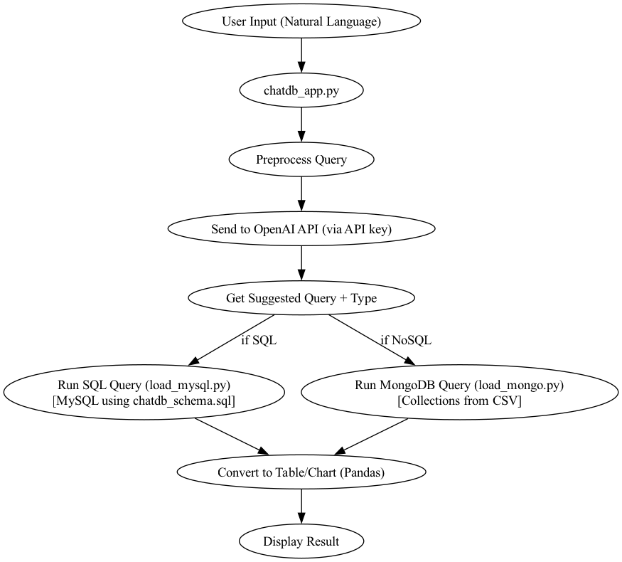

# ChatDB: Natural Language Interface for SQL and NoSQL Databases

A group project where we built a system that lets you query both a MySQL database and a MongoDB database using plain English instead of writing SQL or Mongo queries by hand. You type something like "what's the living wage for one adult with one kid in LA," and it figures out which database that question belongs to, generates the right query with an LLM, runs it, and hands back a readable answer.

## Why we built it this way

The annoying part of working across a relational and a NoSQL database is that you're constantly switching mental models — SQL syntax for one, Mongo's query language for the other. We wanted to see if an LLM could sit in between and route the question to wherever the answer actually lives, without the user needing to know or care which database is which.



## What it does

- Turns natural language into MySQL queries
- Turns natural language into MongoDB queries (via PyMongo)
- Figures out on its own whether a question is a SQL question or a Mongo question
- Prompts are schema-aware, so the LLM knows what tables/collections actually exist
- Handles both reads and writes
- Parses generated Mongo queries with `ast.literal_eval()` instead of `eval()`, since blindly `eval`-ing LLM output is a bad idea

## The two databases

**MySQL** holds the structured stuff — city population data, household types, living wage figures, poverty thresholds. Schema's in `chatdb_schema.sql`.

**MongoDB** holds wage-by-education data split across three collections: `wages_overall`, `wages_gender`, `wages_race`. This was the piece I owned — I designed how the CSV data should get reshaped into these collections and built the loading pipeline for it.

## Try asking it things like

MySQL side:
- "What is the living wage for one adult with one kid in Los Angeles?"
- "Show tables"
- "Update the population of Los Angeles to 4000000"

Mongo side:
- "Show the average bachelor degree wage in 2021"
- "Compare men vs women high school wage in 2020"
- "Update the 2022 black_women_advanced_degree wage to 40.0"

## What I actually built

My part was the MongoDB half of this: designing the schema for the wage-by-education data, writing the pipeline that loads and reshapes the CSVs into the three collections, and building the query execution layer for that side. I also worked with my teammate on getting the SQL and NoSQL paths to plug into one unified natural-language interface rather than being two separate tools bolted together.

## How it fits together

```text
1. Define the relational schema        (chatdb_schema.sql)
2. Load structured data into MySQL     (load_mysql.py)
3. Load and reshape data into MongoDB  (load_mongo.py)
4. Take natural language input
5. Generate a query with the LLM
6. Route it to MySQL or MongoDB
7. Run it, show the result
```

## Repo layout

```text
chatdb-natural-language-database/
│
├── chatdb_app.py
├── chatdb_schema.sql
├── load_mysql.py
├── load_mongo.py
│
├── data/
│   ├── livingwage.csv
│   ├── poverty_level_wages.csv
│   └── wages_by_education.csv
│
├── reports/
│   └── final_report.pdf
│
├── assets/
│   └── chatdb_flow_diagram.png
│
├── README.md
└── requirements.txt
```

## Running it locally

You'll need local MySQL and MongoDB instances running.

```bash
git clone <repo_url>
cd chatdb-natural-language-database
python3 -m venv .venv
source .venv/bin/activate
pip install -r requirements.txt
```

Set up a `.env` file (don't commit this):

```env
OPENAI_API_KEY=your_key_here

MYSQL_HOST=localhost
MYSQL_USER=root
MYSQL_PASSWORD=your_password
MYSQL_DB=chatdb_relational

MONGO_URI=mongodb://localhost:27017/
MONGO_DB_NAME=chatdb_nosql
```

Then:

```bash
mysql -u root -p < chatdb_schema.sql
python load_mysql.py
python load_mongo.py
python chatdb_app.py
```

## Stack

Python, OpenAI API, MySQL, MongoDB, PyMySQL, PyMongo, pandas, python-dotenv, tabulate.
