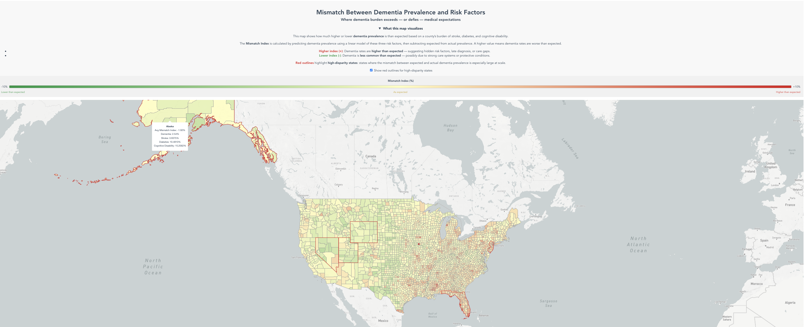

# Dementia Risk Hotspots Visualization

An interactive county-level map showing where dementia prevalence in the US is higher or lower than you'd expect given a county's underlying health risk factors — stroke, diabetes, and cognitive disability rates.



**Live demo:** [full interactive dashboard](https://dsci-554.github.io/project-vizrd/)

## Context

This was a team project for a USC data visualization course — the full dashboard has several other visualizations built by my teammates covering different angles on dementia burden. What's in this repo is specifically the piece I built: the Risk Hotspots analysis and map.

## The idea

Just looking at raw dementia prevalence by county doesn't tell you much on its own, since some counties have higher rates of the underlying conditions that correlate with dementia risk in the first place. So the question I wanted the map to answer was: **given what we'd expect based on stroke, diabetes, and cognitive disability rates, where is dementia prevalence noticeably higher or lower than that expectation?**

I ran a linear regression using those three risk factors to predict expected dementia prevalence per county, then took the gap between observed and predicted as a "Mismatch Index." Positive means higher than expected, negative means lower, near zero means the model's roughly on target. That index gets mapped as a diverging-color choropleth, so you can spot the outlier counties at a glance, with state-level highlighting to call out where the gap is largest.

This is meant as an exploratory tool, not a causal model — it's flagging counties worth looking into further, not explaining why the mismatch exists.

## What I built

- The regression-based Mismatch Index itself
- The data integration between dementia prevalence and CDC PLACES health measures
- The interactive choropleth (built in Vue)
- State-level highlighting for the largest mismatches

## Data

**Dementia prevalence:** [NORC Dementia DataHub](https://dementiadatahub.org/) — 2020 Public Use File, national/state/county estimates for Medicare beneficiaries.

**Risk factors:** [CDC PLACES](https://www.cdc.gov/places/) — county-level modeled estimates for stroke, diabetes, and cognitive disability.

## Stack

Python, pandas, and regression analysis for the Mismatch Index; Vue.js, JavaScript, Mapbox, and HTML/CSS for the interactive map.

## Repo layout

```text
dementia-risk-hotspots-visualization/
├── README.md
├── analysis/
│   └── dementia_mismatch_index.py
├── visualization/
│   └── RiskHotspotsView.vue
├── data/
│   └── dementia_mismatch_index.csv
└── images/
    └── risk_hotspots_dashboard.png
```
