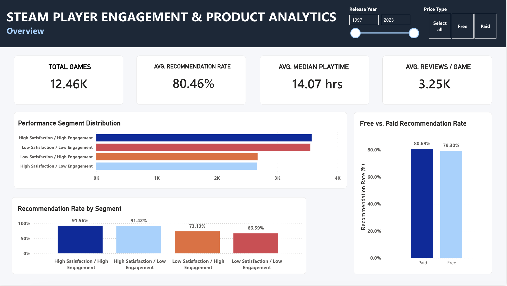
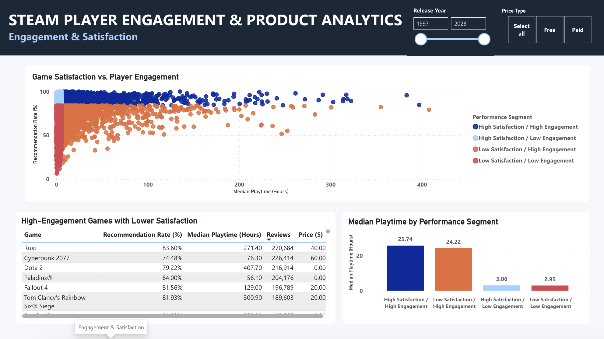
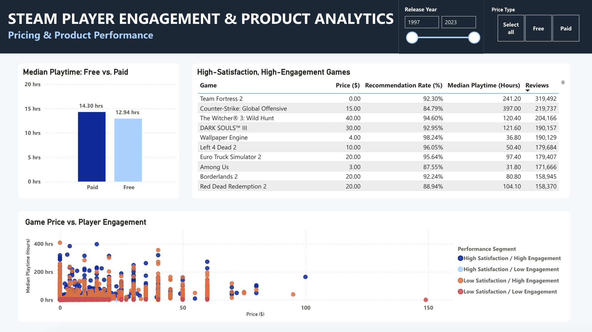

# Steam Player Engagement & Product Analytics

An end-to-end product analytics project exploring how **player satisfaction, engagement, and pricing** relate across Steam games.

The project uses **Python** for data validation, feature engineering, and exploratory analysis, **SQL** for structured product analysis, and **Power BI** for interactive reporting.

## Project Overview

Game performance cannot be understood through a single metric. High playtime may indicate strong engagement, but it does not necessarily mean players are satisfied. Likewise, shorter games may generate limited playtime while still delivering highly positive experiences.

This project explores the broader product question:

> **How do player satisfaction, engagement, and pricing interact, and what do those relationships imply for evaluating game performance?**

The raw dataset contains more than **41 million Steam recommendation records**. After validation and filtering, the primary product-level analysis focuses on **12,460 games** with at least 100 reviews to support more reliable comparisons.

## Dataset

This project uses the **Game Recommendations on Steam** dataset from Kaggle, which contains Steam game information, user data, and more than 41 million recommendation records.

**Source:** [Game Recommendations on Steam — Kaggle](https://www.kaggle.com/datasets/antonkozyriev/game-recommendations-on-steam)

The analysis uses four source files:

| File | Description |
|---|---|
| `games.csv` | Game-level product information, including title, release date, platform availability, ratings, pricing, and review metrics |
| `recommendations.csv` | User-game recommendation records containing recommendation status, playtime, and review information |
| `users.csv` | User-level Steam activity information |
| `games_metadata.json` | Supplemental game metadata |

Due to the size of the source data, the raw files are **not stored in this repository**. They can be downloaded directly from the Kaggle dataset linked above.

The raw data is processed in `notebooks/01_data_analysis.ipynb`, which produces the analysis-ready datasets used by the SQL analysis and Power BI dashboard.

## Business Questions

This project investigates four core questions:

1. How does player satisfaction relate to player engagement?
2. Can games generate high engagement despite comparatively lower satisfaction?
3. How do free and paid games differ in satisfaction and engagement?
4. Does game price appear to explain differences in player engagement?

## Tools & Technologies

- **Python** — data validation, cleaning, feature engineering, aggregation, and exploratory analysis
- **pandas / NumPy** — data transformation and analysis
- **Matplotlib** — exploratory visualization
- **SQLite / SQL** — analytical queries, segmentation, ranking, and dashboard-ready views
- **Power BI** — interactive dashboard development and stakeholder-facing reporting
- **VS Code** — development environment
- **Git / GitHub** — version control and portfolio presentation

## Analysis Workflow

```text
Raw Steam Data
      ↓
Python Data Validation & Analysis
      ↓
Feature Engineering & Aggregation
      ↓
Reliable 12,460-Game Sample
      ↓
SQLite / SQL Product Analysis
      ↓
Power BI Dashboard
      ↓
Product Findings & Recommendations
```

Python was used to validate the raw datasets, investigate data-quality issues, engineer analytical features, and aggregate more than 41 million recommendation records into game-level metrics.

The processed data was then loaded into SQLite, where SQL was used to recreate product segments, compare pricing models, identify high-engagement / lower-satisfaction products, rank games using window functions, and create reusable dashboard views.

Power BI was used to turn the analysis into an interactive three-page report.

## Key Metrics

| Metric | Result |
|---|---:|
| Games in reliable analysis sample | 12,460 |
| Average recommendation rate | 80.46% |
| Average game-level median playtime | 14.07 hrs |
| Average reviews per game | 3.25K |

## Performance Segmentation

Games were classified using recommendation rate as a measure of **player satisfaction** and median playtime as a measure of **player engagement**.

| Performance Segment | Games | Avg. Recommendation Rate | Avg. Median Playtime |
|---|---:|---:|---:|
| High Satisfaction / High Engagement | 3,571 | 91.56% | 25.74 hrs |
| High Satisfaction / Low Engagement | 2,663 | 91.42% | 3.06 hrs |
| Low Satisfaction / High Engagement | 2,676 | 73.13% | 24.22 hrs |
| Low Satisfaction / Low Engagement | 3,550 | 66.59% | 2.95 hrs |

The segmentation highlights why satisfaction and engagement should be evaluated together rather than treating playtime alone as an indicator of product success.

## Key Findings

### 1. Engagement and satisfaction measure different dimensions of performance

High-engagement games are not universally high-satisfaction.

The **High Satisfaction / High Engagement** segment averages a **91.56% recommendation rate**, compared with **73.13%** for the **Low Satisfaction / High Engagement** segment, despite both groups averaging approximately 24–26 hours of median playtime.

**Product takeaway:** high engagement should not be used as a standalone proxy for player satisfaction.

### 2. Low engagement does not necessarily indicate a weak product

High Satisfaction / Low Engagement games average a **91.42% recommendation rate**, nearly identical to the **91.56%** observed among High Satisfaction / High Engagement games.

Their average game-level median playtime differs substantially:

- High Satisfaction / High Engagement: **25.74 hrs**
- High Satisfaction / Low Engagement: **3.06 hrs**

**Product takeaway:** shorter experiences can still generate extremely positive player experiences, so engagement targets should reflect product context.

### 3. Paid games show only a modest advantage over free games

| Price Type | Games | Avg. Recommendation Rate | Avg. Median Playtime |
|---|---:|---:|---:|
| Paid | 10,397 | 80.69% | 14.30 hrs |
| Free | 2,063 | 79.30% | 12.94 hrs |

Paid games perform somewhat better on both primary metrics, but the differences are relatively modest.

**Product takeaway:** pricing model alone does not explain major differences in satisfaction or engagement.

### 4. Price alone is a weak indicator of engagement

Games at similar price points show substantial differences in median playtime, while highly engaged titles appear across free, inexpensive, and higher-priced products.

**Product takeaway:** pricing decisions should be evaluated alongside player satisfaction, engagement, audience expectations, and product positioning rather than assuming higher prices correspond to greater player investment.

## Product Recommendations

Based on the analysis:

- Track **satisfaction and engagement together** rather than optimizing either metric in isolation.
- Investigate **high-engagement / lower-satisfaction games** for potential sources of player friction.
- Avoid treating low playtime as inherently negative; evaluate engagement relative to the intended player experience.
- Treat Free vs. Paid as a product-strategy distinction rather than a direct measure of product quality.
- Evaluate pricing alongside satisfaction, engagement, audience expectations, and product positioning.

See [`findings/recommendations.md`](findings/recommendations.md) for the detailed findings, evidence, implications, and recommendations.

## Power BI Dashboard

The final Power BI report contains three interactive pages.

### 1. Overview

Provides a high-level view of the reliable game sample, including:

- total games
- average recommendation rate
- average game-level median playtime
- average review volume
- performance segment distribution
- Free vs. Paid recommendation rates
- Release Year and Price Type filters



### 2. Engagement & Satisfaction

Explores how recommendation rate varies with player engagement and highlights games that generate substantial playtime despite comparatively lower satisfaction.



### 3. Pricing & Product Performance

Examines pricing model, the relationship between game price and engagement, and large-scale games that combine high satisfaction with high engagement.



## SQL Analysis

The SQL portion demonstrates:

- table creation and schema definition
- data validation
- aggregation and grouping
- CTEs
- `CASE WHEN` segmentation
- benchmark comparisons
- filtering and ranking
- window functions using `ROW_NUMBER()`
- dashboard-ready SQL views

Key files:

- [`01_setup.sql`](sql/01_setup.sql) — creates the SQLite tables and imports processed data
- [`02_product_analysis.sql`](sql/02_product_analysis.sql) — answers core product-analysis questions
- [`03_dashboard_queries.sql`](sql/03_dashboard_queries.sql) — creates reusable views for dashboard reporting

## Python Analysis

The Python notebook covers:

- dataset structure and data-quality validation
- missing-value checks
- primary- and foreign-key validation
- value and boundary investigation
- pricing consistency checks
- date transformation
- feature engineering
- engagement segmentation
- game-level behavioral aggregation
- reliable-sample selection
- correlation analysis
- Free vs. Paid comparisons
- pricing analysis
- performance segmentation
- processed-data export

See:

[`01_data_analysis.ipynb`](notebooks/01_data_analysis.ipynb)

## Project Structure

```text
gaming-product-analytics/
│
├── README.md
├── requirements.txt
├── .gitignore
│
├── data/
│   ├── raw/                              # Local source data (not tracked by Git)
│   │   ├── games.csv
│   │   ├── games_metadata.json
│   │   ├── recommendations.csv
│   │   └── users.csv
│   │
│   └── processed/
│       ├── game_analysis.csv
│       ├── gaming_analytics.db
│       └── reliable_games.csv
│
├── notebooks/
│   └── 01_data_analysis.ipynb
│
├── sql/
│   ├── 01_setup.sql
│   ├── 02_product_analysis.sql
│   └── 03_dashboard_queries.sql
│
├── dashboard/
│   └── images/
│       ├── 01_overview.png
│       ├── 02_engagement_satisfaction.png
│       └── 03_pricing_product_performance.png
│
└── findings/
    └── recommendations.md
```

> Large raw datasets and the local SQLite database are excluded from version control and can be recreated using the project workflow.

## Data Quality & Methodology

The raw datasets contain:

- game-level product information
- user-level Steam activity
- more than 41 million recommendation records
- supplemental game metadata

The data was validated before analysis, including checks for missing values, identifier uniqueness, table relationships, pricing inconsistencies, extreme playtime values, and unusual behavioral records.

Because games with very few reviews can produce unstable recommendation rates, product-level comparisons use a minimum threshold of **100 reviews**.

This produced the final reliable sample of **12,460 games**.

The threshold is a practical analytical choice intended to balance reliability and catalog coverage rather than a claim of statistical significance.

## Limitations

- Steam recommendation behavior represents only one measure of player satisfaction.
- Playtime naturally varies by genre, game design, and intended experience.
- Review activity differs substantially across games and player populations.
- Current price and discount data represent a snapshot rather than longitudinal pricing history.
- Observed relationships describe **associations rather than causal effects**.
- Additional variables such as genre, multiplayer status, monetization design, update cadence, and acquisition source could provide further explanatory power.

## Reproducing the Project

Install the Python dependencies:

```bash
pip install -r requirements.txt
```

Run the Python analysis notebook:

```text
notebooks/01_data_analysis.ipynb
```

Then create the SQLite database from the project root:

```bash
sqlite3 data/processed/gaming_analytics.db < sql/01_setup.sql
```

Run the product-analysis queries:

```bash
sqlite3 -header -column data/processed/gaming_analytics.db < sql/02_product_analysis.sql
```

Create the dashboard-ready SQL views:

```bash
sqlite3 data/processed/gaming_analytics.db < sql/03_dashboard_queries.sql
```

## Conclusion

Steam game performance is **multidimensional**.

Strong engagement does not guarantee strong satisfaction, while low engagement does not necessarily indicate an unsuccessful player experience. Free and paid titles perform relatively similarly across the primary metrics, and price alone provides limited insight into player engagement.

For product decision-making, satisfaction, engagement, pricing, and product context should therefore be evaluated together rather than optimizing any single KPI in isolation.
