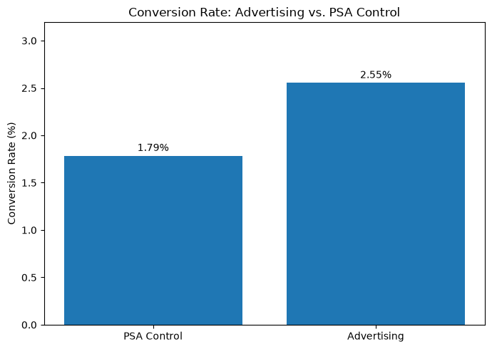
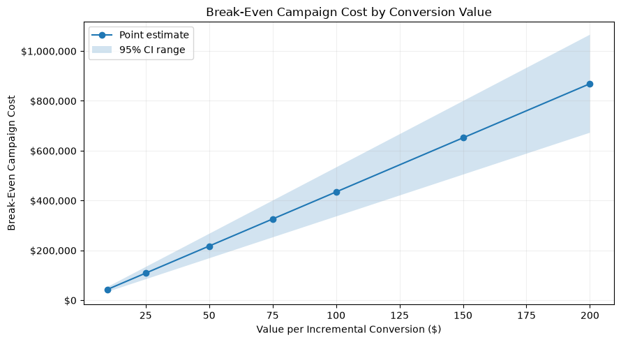
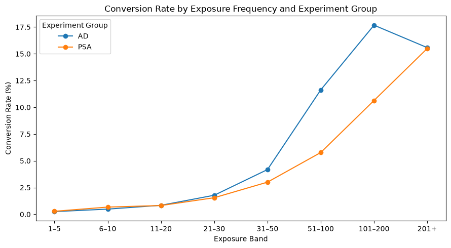

# Marketing Experiment & Incrementality Analysis

Most A/B test writeups stop at "the p-value was small, ship it." I wanted to build one that didn't — where the actual deliverable is a decision, not a test statistic. So this project asks two questions instead of one: did the ad campaign work, *and* was it worth what it cost?

## The setup

The data comes from a real ad campaign ([Marketing A/B Testing, Kaggle](https://www.kaggle.com/datasets/faviovaz/marketing-ab-testing)) — 588,101 users, split between an `ad` group who saw the actual campaign and a `psa` control group who got a public service announcement instead. For each user I have whether they converted, how many total ads they were shown, and the day/hour they were most exposed. That's it — no cost data, no revenue data, which turned out to matter a lot for how I approached the second half of the project.

One thing worth flagging up front: the split wasn't even — about 96% of users landed in the ad group and only 4% in PSA. I don't have the intended allocation ratio, so I can't say for certain whether that's a sample-ratio mismatch or just how the experiment was designed. I noted it rather than pretending it isn't there.

## Did the ads work?

Yes, and not marginally:

| | PSA Control | Advertising |
|---|---:|---:|
| Users | 23,524 | 564,577 |
| Conversions | 420 | 14,423 |
| Conversion Rate | 1.785% | 2.555% |

That's a 0.769 percentage-point absolute lift, or about 43% relative — z = 7.37, p < 0.001, 95% CI on the lift is [0.595%, 0.943%], entirely above zero. Statistically this isn't close.

But I didn't want to stop at "significant." At 588K users, almost any real effect is going to clear that bar — the more useful number is how many actual conversions that lift represents. If the ad group had converted at the PSA rate instead, I'd expect about 10,080 conversions; they actually generated 14,423. That's roughly **4,343 incremental conversions**, with a 95% CI of about 3,360 to 5,326.



## Turning that into a business answer

Here's the problem: I don't know what the campaign cost, and I don't know what a conversion is actually worth. Rather than picking an arbitrary dollar figure and pretending I know the ROI, I flipped the question — instead of "what's the ROI," I asked "**how much would a conversion need to be worth for this campaign to break even?**"

Break-even cost = incremental conversions × value per conversion. So if a conversion is worth $100, the campaign breaks even around $434K in spend (or about $336K using the conservative lower-CI bound). Plug in your own assumption about conversion value and the answer scales linearly — which is really the point. This turns a single p-value into something a stakeholder with actual cost numbers could use immediately.



## Where I had to be careful

The dataset also has `total ads` — how many times each user was exposed — and conversion climbs sharply with it, from about 0.25% at 1–5 exposures up to nearly 18% at 101–200 exposures. My first instinct was "great, more ads = more conversions, show more ads." But that pattern shows up in the **PSA group too**, not just advertising. Exposure count wasn't randomized — it's something that happened *after* assignment, and it's probably picking up on how active a user is on the platform generally, not a causal effect of ad volume.



So I'm explicit about this in the analysis: I'm not claiming showing people more ads causes more conversions. That would need its own randomized frequency test. Same logic applies to the day/hour timing patterns — interesting, but not something I'd act on without testing it directly.

## Bottom line

**Continue the campaign, conditional on the actual numbers.** The experiment is solid evidence that advertising beats the PSA control — the confidence interval never touches zero, and the incremental-conversion estimate gives a concrete number to work with. Whether it's worth continuing comes down to comparing real campaign cost against the break-even threshold for whatever a conversion is actually worth to the business. I can't answer that without cost data, but I've set up the framework so someone who has it can.

If I were designing the next round of testing, I'd want to see:
- **A randomized exposure-frequency test** — actually assign different ad frequencies instead of just observing them, to find whether there's a point of diminishing returns.
- **A randomized timing test** — same idea, applied to delivery windows.
- **Cost and revenue data captured alongside the experiment**, so incremental profit and cost-per-conversion could be calculated directly instead of through a sensitivity table.

## What this data can't tell me

No cost or revenue-per-conversion data, no documented target allocation ratio, limited pre-treatment user info for balance checks, and exposure frequency / timing weren't randomized — so those two pieces are hypothesis-generating, not causal claims. None of that undermines the core ad-vs-PSA result, but it's why I kept the secondary analyses framed as "worth testing further" rather than "here's what to do."

## Repo structure

```text
marketing-experiment-analysis/
├── README.md
├── requirements.txt
├── .gitignore
│
├── data/
│   ├── raw/
│   │   └── marketing_AB.csv
│   └── processed/
│       └── marketing_ab_clean.csv
│
├── notebooks/
│   └── 01_experiment_analysis.ipynb
│
├── sql/
│   └── experiment_metrics.sql
│
├── findings/
│   └── recommendation.md
│
└── outputs/
    └── figures/
```

The SQL file reproduces the core group sizes, conversion counts, and rates — the actual hypothesis test and CI are done in Python (statsmodels), since SQLite doesn't have a native z-test.

## Running it

```bash
pip install -r requirements.txt
```

Then run `notebooks/01_experiment_analysis.ipynb` top to bottom — it walks through validation, the hypothesis test, the break-even analysis, and the exposure/timing exploration in order.

## Tools

Python (pandas, NumPy, statsmodels, Matplotlib), SQLite for the SQL layer, two-proportion z-test and CI estimation for the core inference, break-even sensitivity analysis for the business translation.
