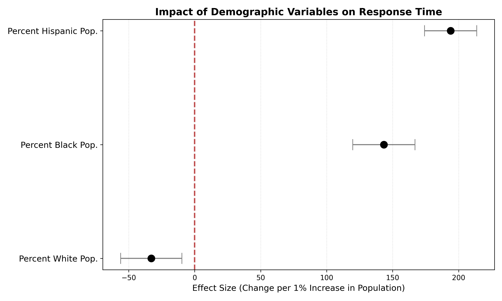
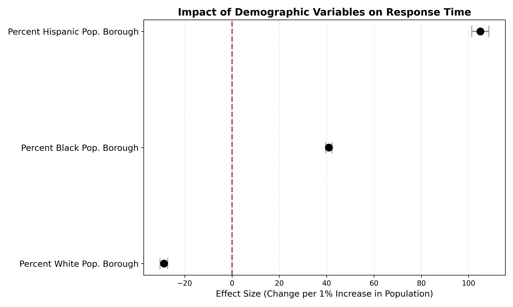

# NYC EMS Fairness Analysis

I started this project with a fairly narrow question: if you looked at NYC emergency response times and controlled for how urgent the incident actually was, would neighborhoods still look different from each other? It's easy to compare average response times across the city and call it a day, but that comparison doesn't mean much if some neighborhoods just happen to have more severe calls on average. I wanted to compare like with like.

## The actual question

**Do NYC neighborhoods get comparable response times for incidents of similar medical urgency?**

Instead of comparing boroughs or ZIP codes head-on, I split incidents into severity tiers first (High, Medium, Low) and only then compared demographic and income groups *within* each tier. That's the core design choice the whole project sits on — it's a conditional comparison, not a raw average.

## How I got there

I pulled Q1 2024 NYC EMS dispatch data and matched it to 2022 ACS demographic data at the ZIP/ZCTA level — EMS data doesn't include patient demographics, so neighborhood-level ACS figures are the closest proxy available, and I want to be upfront that this is a proxy, not individual patient data. After cleaning and merging (notebooks 01–02), I built the severity tiers (03), then ran the fairness comparisons within those tiers (04), followed by regression models that control for operational factors like borough and time of day, plus a geographic robustness check to make sure the results weren't an artifact of how I'd drawn the ZIP boundaries (05). Notebook 06 pulls everything into the final tables and figures.

Statistically, I leaned on a mix of tests rather than one — Welch's t-test and Mann–Whitney U for the group comparisons (Welch's because I couldn't assume equal variances across groups, Mann–Whitney as a check since response times are right-skewed), one-way ANOVA where I had more than two groups, FDR correction since I was running a lot of comparisons at once, and OLS regression with operational controls to see if the demographic association survived adjustment.

## What I found

Response times were consistently longer in ZIP codes with higher Black population share, and this held up *within* comparable severity tiers — it wasn't just that these neighborhoods happened to have more severe calls. The gap actually got wider as urgency decreased, which makes some intuitive sense: the most critical calls probably get prioritized regardless, so disparities show up more in the calls that don't trigger the same urgency. Lower-income neighborhoods showed a similar pattern, again concentrated in less-critical incidents. And the demographic association didn't disappear once I controlled for borough and time of day in the regression — it persisted.

None of this means the EMS system is inefficient in aggregate. Citywide averages can look fine while still masking a real, consistent gap underneath. Both things can be true at once.

I want to be careful about what these results do and don't say. Because the demographic data is measured at the ZIP/ZCTA level, not for individual patients, these are area-level associations — I can't say anything about any individual person's experience, only about patterns across neighborhoods. And this is observational data; I'm not claiming to have identified the mechanism (dispatch decisions, resource allocation, traffic patterns, staffing — I don't have visibility into the internal dispatch system to distinguish between these).




More figures and the full statistical output are in [`outputs/`](outputs/), and the complete writeup with all the methodology detail is in the [final report](report/final_report.pdf).

## Data sources

**NYC EMS Incident Dispatch Data (Q1 2024):** [NYC Open Data](https://data.cityofnewyork.us/Public-Safety/EMS-Incident-Dispatch-Data/76xm-jjuj) — incident timing, location, and operational fields used to calculate response times.

**American Community Survey (2022):** [U.S. Census Bureau](https://www.census.gov/programs-surveys/acs) — neighborhood demographic and income measures, matched to EMS incidents by ZIP/ZCTA.

```text
data/
├── raw/
│   ├── nyc_ems_2024q1_raw.parquet
│   ├── acs_2022_acs5_zcta_full.parquet
│   └── acs_2022_zip.parquet
└── processed/
    ├── nyc_ems_2024q1_usable.parquet
    ├── merged_ems_acs.parquet
    ├── merged_ems_acs_w_groups.parquet
    └── merged_ems_acs_with_severity.parquet
```

Each processed file represents a stage of the pipeline — cleaned EMS records, then merged with ACS data, then group variables added, then the final severity-enriched dataset used for analysis.

## Repo layout

```text
nyc-ems-fairness-analysis/
├── README.md
├── requirements.txt
├── data/
│   ├── raw/
│   └── processed/
├── notebooks/
│   ├── 01_data_ingest.ipynb
│   ├── 02_cleaning_and_merging.ipynb
│   ├── 03_severity_grouping.ipynb
│   ├── 04_fairness_evaluation.ipynb
│   ├── 05_regression_and_robustness.ipynb
│   └── 06_generate_final_tables_figures.ipynb
├── outputs/
│   ├── figures/
│   └── tables/final/
└── report/
    └── final_report.pdf
```

| Notebook | What it does |
|---|---|
| `01_data_ingest.ipynb` | Pull in EMS and ACS data |
| `02_cleaning_and_merging.ipynb` | Clean records, merge EMS with ACS |
| `03_severity_grouping.ipynb` | Build the severity tiers |
| `04_fairness_evaluation.ipynb` | Compare groups within tiers |
| `05_regression_and_robustness.ipynb` | Adjusted regressions + robustness checks |
| `06_generate_final_tables_figures.ipynb` | Final tables and figures |

## Tools

Python (pandas, NumPy), SciPy and statsmodels for the statistical work, PyArrow for the parquet files, Matplotlib for the figures.

## Running it

```bash
python3 -m venv .venv
source .venv/bin/activate
pip install -r requirements.txt
```

If you want to regenerate the ACS data yourself through the Census API rather than using the parquet files as-is, you'll need a `.env` file with `CENSUS_API_KEY=your_key_here` (don't commit this).

Run the notebooks in order, 01 through 06 — each stage depends on the intermediate output of the one before it, saved under `data/processed/`.

## Limitations I want to be explicit about

Demographic data here is neighborhood-level, not patient-level, so everything is an area-level association, not a claim about individuals. This is observational data, so I can't establish that neighborhood demographics *cause* the response-time differences — only that they're statistically associated with them after controlling for what I could measure. I don't have visibility into the internal EMS dispatch system, so I'm working from observed outcomes rather than the decisions that produced them. And geographic aggregation choices can shift results (the modifiable areal unit problem), which is why the robustness checks specifically test sensitivity to how the geography is drawn.
